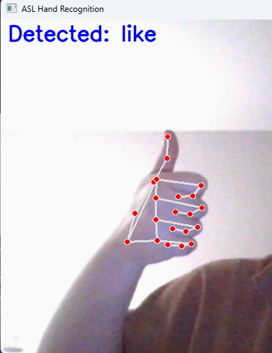
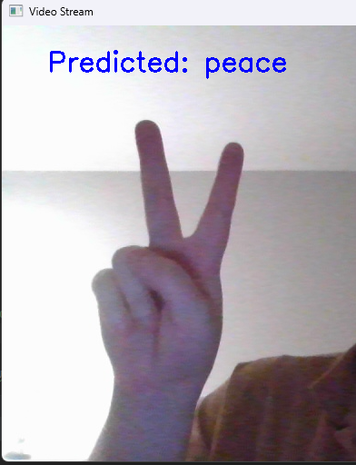

# Hand Gesture Recognition
 Сравнение подходов к задаче распознавания жестов

## Задача
Необходимо проанализировать существующие подходы к задаче распознавания жестов, учитывая следующие условия:
- Число распознаваемых жестов: не менее 5;
- Работа в реальном времени;
- Выбор данных не ограничен;

## Что было сделано

1. Проанализированы существующие подходы и инструменты для решения задачи, результаты приведены в таблице:

| Подход | Нужен датасает | Реальное время | Точность | Сложность реализации | Комментарий |
|------: | :--------------: | :--------------: | :--------------: | :--------------: | :------- |
| [MediaPipe](https://github.com/google-ai-edge/mediapipe/blob/master/mediapipe/python/solutions/hands.py) + Логика | Нет | Да | Низкая | Легко | Используем MP для определения ключевых точек на руках и оперируем координатами точек |
| OpenCV + Логика | Нет | Да | Низкая | Легко | Используем выделение ключевых точек и контуров средствами OpenCV, оперируем ключевыми точками и формой ладони |
| [MediaPipe](https://github.com/google-ai-edge/mediapipe/blob/master/mediapipe/python/solutions/hands.py) + ML | Да | Да | Высокая | Средне | Используем MP для определения ключевых точек на руках и обучаем модель по точкам |
| Pytorch/Tensorflow (CNN) | Да* | Да** | Высокая | Высокая | Обучаем модель на изображениях. Согласно статьям, можно получить точность до 98% AP у моделей архитектуры ResNet, однако необходим большой набор данных |
| [GRLib](https://github.com/mikhail-vlasenko/grlib) | Нет | Да | Высокая | Легко (готовое решение) | Библиотека не обновлялась несколько лет, но авторы утверждают, что точность на датасетах ASL и HaGRID порядка CNN |

\* Есть возможность взять предобученную модель
\** Зависит от модели и реализации

2. Выбор жестов

- Fist (сжатый кулак)
- Stop (ладонь)
- Peace (указательный и средний пальцы буквой "V")
- Like (большой палец вверх)
- Dislike (большой палец вниз)

3. Выбор подхода

Были реализованы следующие подходы:
- MediaPipe + Логика (описание алгоритма: с помощью MediaPipe вычисляем ключевые точки "landmarks" на кисти человека, при помощи условий, наложенных на координаты, определяем жест логически)
- Pytorch/Tensorflow (CNN) (описание алгоритма: используется модель ResNet18, предобученная на датасете [HaGRID](https://github.com/hukenovs/hagrid))

4. Результаты

- Первый подход (MP + Логика) демонстрирует высокую скорость обработки изображений (менее минуты на 3000 изображений размером 200x200 пикс. при работе на CPU), но невысокую точность (до 76% AP, есть трудности с опредлением похожих жестов, например, Like и Fist)
- Пример:  
- Второй подход (ResNet18) показал высокую точность определения жестов (до 96% AP, определяются 34 класса, в том числе схожие жесты, например, 4 пальца и прямая ладонь), однако требует больше времени на работу (более 2 минут на CPU)
- Пример: 

5. Заключение
- С точки зрения точности, второй подход предпочтителен. Первый подход рекомендуется в тех случаях, когда скорость работы важнее точного определения.

## Использование

Для определения жестов на видеопотоке с камеры:
- ``` python naive_from_video.py ```
- ``` python resnet_from_video.py ```
